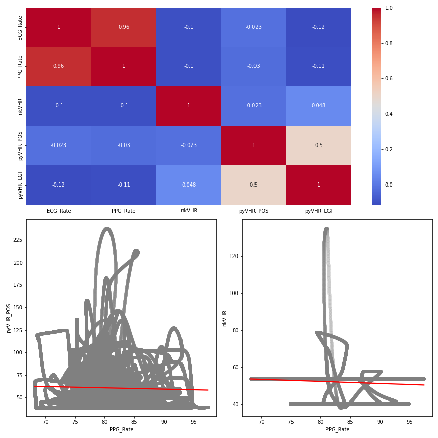
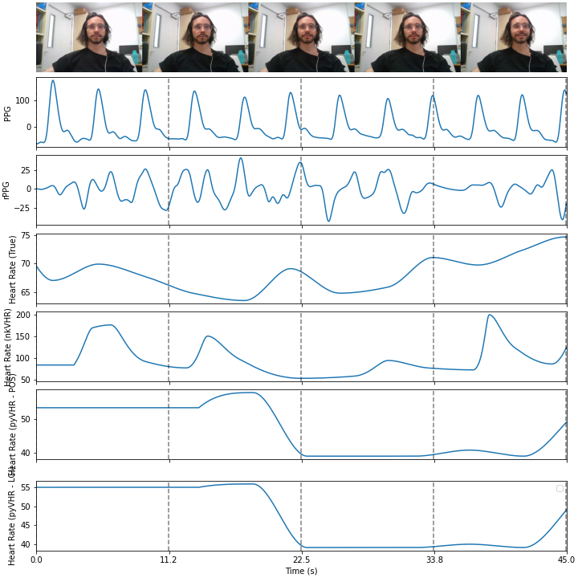

# Open Remote Physiology Dataset (remophysio)

An exploration of tools to extract physiological features (heart rate, blinks, ...) from webcam recordings, that can be used in online experiments.

We compared the algorithms available in the [**NeuroKit**](https://github.com/neuropsychology/NeuroKit/pull/736) package for remote physiology with other established implementations, against a ground truth of true physiological data.

## Methods

### Data

Researchers who agreed to share their data underwent an 8-min resting state paradigm (using the [**Replicable Resting-state Task**](https://github.com/RealityBending/RestingState) in jsPsych). Faces were recorded using the laptop's commercial webcam (30 Hz), and physiological signals (ECG, PPG, RSP) were recorded using BITalino (1000 Hz).

### Preprocessing

#### Heart Rate

The "true" heart rate was computed from the PPG signal using [**NeuroKit**](https://github.com/neuropsychology/NeuroKit).

See `preprocessing.py`.

### Results

#### S3A

#### S4A

## Discussion